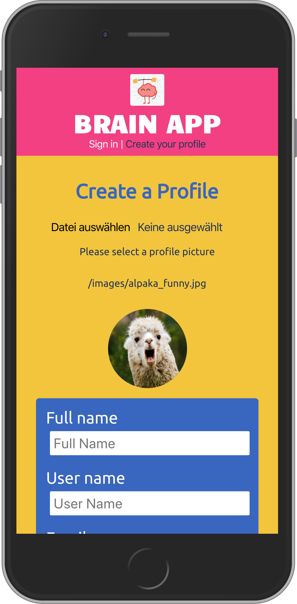
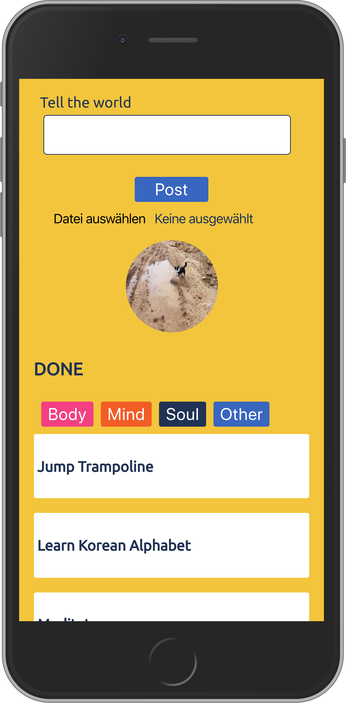
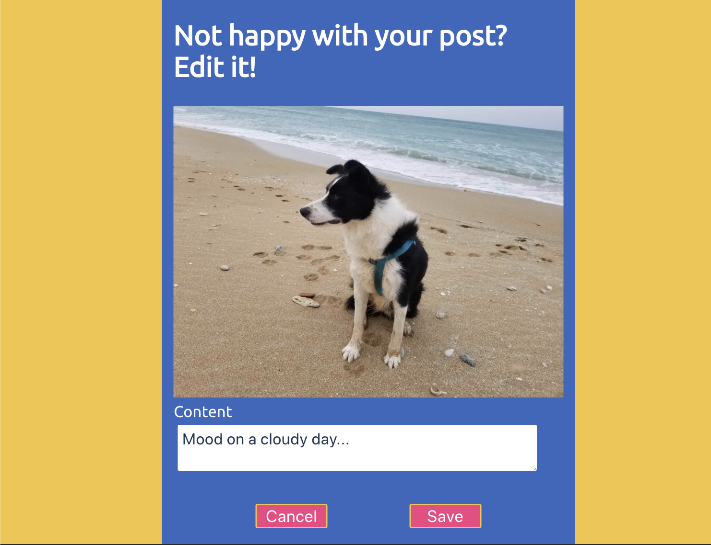

<h1>Brain App</h1>

<h2>Live: https://brain-app.now.sh/</h2>

<h1>Description</h1>

'Brain App' helps you to do every day something that you have never done before. 

<h1>Features</h1>

The App consists of two basic features:

1. Create your own bucket-list by choosing tasks from a given list or set your own daily tasks.
2. Post what you have already achieved.

<h1>Landing page</h1>

 
 

<h1>Registration</h1>

<h1>Login:</h1>

<h1>Dashboard</h1>

<h1>Dashboard: To Do Section</h1>

<h1>Dashboard: Post Section</h1>

<h1>Dashboard: Add Post Section</h1>

<h1>Dashboard: Done Section</h1>

<h1>Task List</h1>

<h1>Add Task</h1>

<h1>Edit Post</h1>

Built with:

Client side: React, JavaScript, Zeit, HTML and CSS.

Server side: Express.js, Node.js, PostgreSQL, aws and Heroku.

